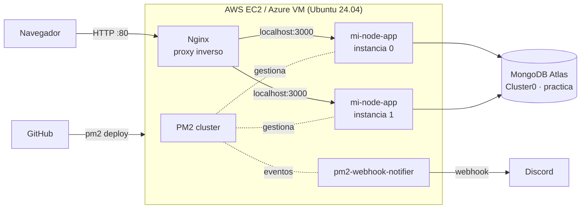

# Practica-AWS-NODE

API REST de empleados en **Node.js + Express**, desplegada en producción en **AWS EC2** y **Azure VM** con **Nginx** como proxy inverso, **PM2** en modo clúster, despliegue continuo desde GitHub, persistencia en **MongoDB Atlas** y alertas en tiempo real por **Discord**.

> Práctica 06 — *Despliegue de Aplicaciones Node.js en Producción utilizando AWS, Nginx y PM2*
> Maestría en Software · Patrones de Diseño de APIs · Universidad Politécnica Salesiana

**Repositorio:** https://github.com/Mesias-prog/Practica-AWS-NODE

## Despliegues

| Nube | URL | Servidor |
|---|---|---|
| AWS EC2 | http://3.138.218.34 | t3.micro · Ubuntu 24.04 · us-east-2 (Ohio) · IP elástica |
| Azure VM | http://130.131.46.243 | Standard_B2ats_v2 · Ubuntu 24.04 · northcentralus · IP estática |

Las dos comparten la misma base de datos: un registro creado en una nube aparece al instante en la otra.

> Los servidores se apagan cuando no se usan para reducir costos (`bash deploy/nubes.sh apagar`). Si las URLs no responden, están apagados.

## Arquitectura



- **Seguridad de red:** solo los puertos 80/443 están abiertos al público. El puerto 3000 de Node.js nunca se expone. SSH (22/2222) solo se permite desde la IP del administrador.
- **Alta disponibilidad:** PM2 levanta una instancia por vCPU, las reinicia si fallan y recarga sin cortar el servicio (`pm2 reload`).
- **Secretos:** `MONGODB_URI` y `WEBHOOK_URL` viven solo en `/var/www/tu-app/shared/.env` de cada servidor; nunca en el repositorio.

## Tecnologías

Node.js 24 · Express 5 · Mongoose 9 · MongoDB Atlas (M0) · Nginx · PM2 (cluster, deploy, logrotate) · AWS EC2 · Azure Virtual Machines · Discord Webhooks · GitHub

## API

| Método | Ruta | Descripción |
|---|---|---|
| `GET` | `/health` | Estado del servidor, instancia de PM2 y conexión a la base de datos |
| `GET` | `/api/empleados` | Lista los empleados |
| `GET` | `/api/empleados/:id` | Obtiene un empleado |
| `POST` | `/api/empleados` | Crea un empleado `{ nombre, cargo, salario }` |
| `PUT` | `/api/empleados/:id` | Actualiza un empleado |
| `DELETE` | `/api/empleados/:id` | Elimina un empleado |

La página principal (`/`) incluye un formulario para registrar y eliminar empleados y muestra qué servidor atendió la petición.

**Patrón Repositorio:** el controlador usa siempre la misma interfaz. `src/db.js` elige el repositorio de **MongoDB** cuando existe `MONGODB_URI` y el repositorio **en memoria** cuando no existe (desarrollo y pruebas).

## Estructura

```
index.js                       Servidor Express, arranque y apagado ordenado
src/
  db.js                        Conexión y selección del repositorio
  models/empleado.model.js     Esquema de Mongoose
  repositories/                Repositorios MongoDB y en memoria
  controllers/ routes/         Controlador y rutas REST de empleados
public/index.html              Interfaz web
notifier/webhook-notifier.js   Alertas de PM2 a Discord / Slack
ecosystem.config.js            PM2: clúster, logs, variables y destinos de despliegue
deploy/
  provision-aws.sh             Crea EC2, grupo de seguridad e IP elástica
  provision-azure.sh           Crea la VM, la IP estática y las reglas de red
  setup-server.sh              Instala Node, Nginx, PM2 y la deploy key en el servidor
  nginx-default.conf           Proxy inverso 80 -> 3000
  ec2-user-data.sh             SSH también en el puerto 2222 al primer arranque
  nubes.sh                     Enciende / apaga / consulta los servidores
test/api.test.js               Pruebas de la API
GUIA.md                        Guía paso a paso de la práctica
```

## Uso

**Local**

```bash
npm install
npm run dev          # http://localhost:3000 (datos en memoria)
npm test
```

**Despliegue continuo** (desde Git Bash, después de `git push`):

```bash
npm run deploy         # AWS
npm run deploy:azure   # Azure
```

**Encender / apagar los servidores**

```bash
bash deploy/nubes.sh encender
bash deploy/nubes.sh apagar
bash deploy/nubes.sh estado
```

La instalación completa desde cero está en la **[guía paso a paso](GUIA.md)**.

## Pruebas de verificación

| Prueba | Cómo | Resultado esperado |
|---|---|---|
| Red | Abrir `http://IP` y `http://IP:3000` | La app responde en el puerto 80; el 3000 no responde |
| Resiliencia | `pm2 stop mi-node-app` y `pm2 start mi-node-app` | Llegan alertas 🛑 STOP y 🔄 RESTART a Discord |
| CI/CD | Cambiar `public/index.html`, `git push`, `npm run deploy` | El cambio aparece sin entrar al servidor |
| Persistencia | Crear un empleado y ejecutar `pm2 reload` | El empleado sigue en la app y en Atlas |
